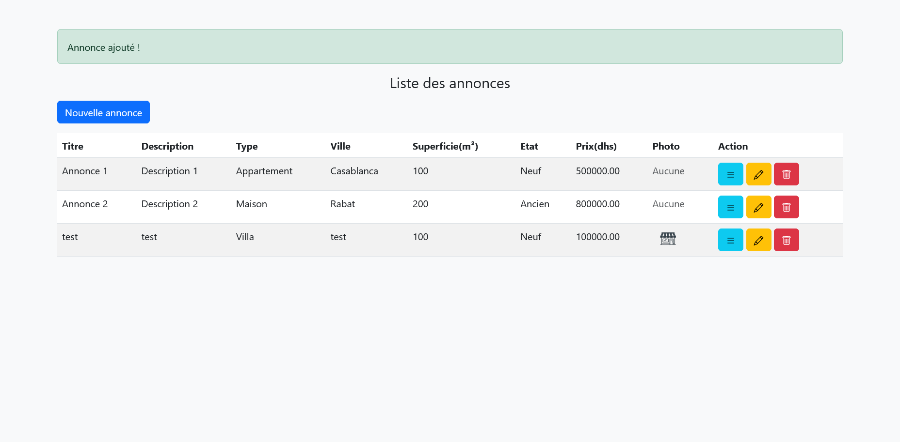
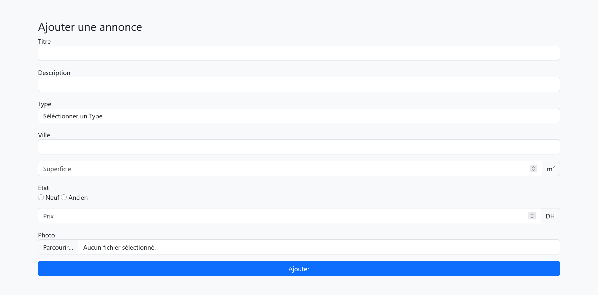
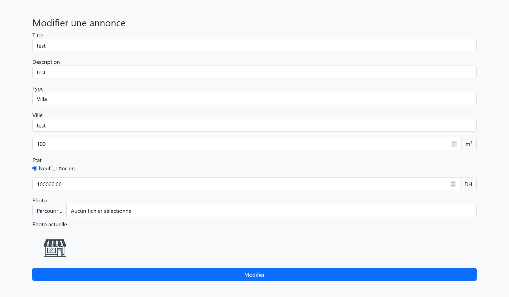
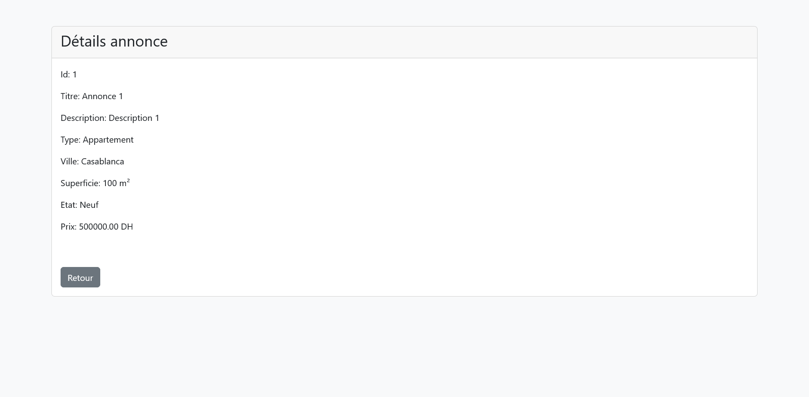
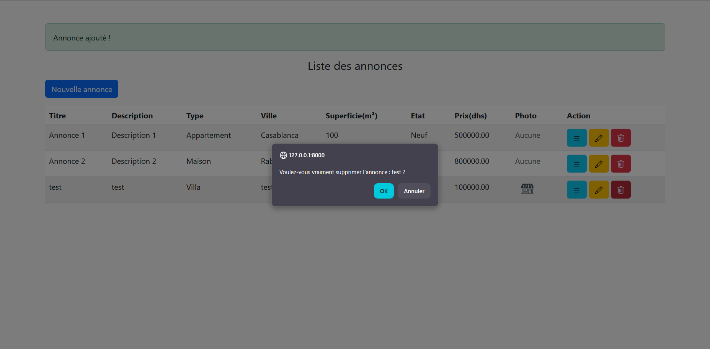

<div align="center">

# 🏠 Ges-Annonce

### Application de Gestion des Annonces Immobilières


*Application Laravel permettant de gérer des annonces de vente immobilière (CRUD complet) avec upload de photos et dashboard de statistiques.*

</div>

---

## 📋 Prérequis

| Outil | Version |
|-------|---------|
| PHP | >= 8.1 |
| Composer | Dernière version |
| MySQL | Dernière version |
| Node.js & NPM | Dernière version |

---

## ⚙️ Installation

**1. Créer le projet**
```bash
composer create-project laravel/laravel ges-annonce
cd ges-annonce
```

**2. Configurer la base de données dans `.env`**
```bash
DB_CONNECTION=mysql
DB_HOST=127.0.0.1
DB_PORT=3306
DB_DATABASE=ges-annonce
DB_USERNAME=root
DB_PASSWORD=
```

**3. Créer les fichiers via Artisan**
```bash
php artisan make:migration create_annonce_table
php artisan make:migration add_photo_to_annonce_table
php artisan make:seeder AnnoncesTableSeeder
php artisan make:model Annonce
php artisan make:controller AnnonceController --resource
```

**4. Exécuter les migrations**
```bash
php artisan migrate
```

**5. Créer le lien Storage**
```bash
php artisan storage:link
```

**6. Exécuter le seeder**
```bash
php artisan db:seed --class=AnnoncesTableSeeder
```

**7. Lancer le serveur**
```bash
php artisan serve
```

---

## 📁 Structure du projet

```
ges-annonce/
├── app/
│   ├── Http/
│   │   └── Controllers/
│   │       └── AnnonceController.php
│   └── Models/
│       └── Annonce.php
├── database/
│   ├── migrations/
│   │   ├── create_annonce_table.php
│   │   └── add_photo_to_annonce_table.php
│   └── seeders/
│       └── AnnoncesTableSeeder.php
├── resources/
│   └── views/
│       ├── layouts/
│       │   └── layout.blade.php
│       └── annonce/
│           ├── index.blade.php
│           ├── create.blade.php
│           ├── edit.blade.php
│           ├── show.blade.php
│           ├── form.blade.php
│           └── dashboard.blade.php
└── routes/
    └── web.php
```

---

## 🗺️ Routes disponibles

```bash
php artisan route:list
```

| Method | URI | Name | Description |
|--------|-----|------|-------------|
| `GET` | /annonces/dashboard | — | Dashboard statistiques |
| `GET` | /annonce | annonce.index | Liste des annonces |
| `GET` | /annonce/create | annonce.create | Formulaire création |
| `POST` | /annonce | annonce.store | Enregistrer annonce |
| `GET` | /annonce/{id} | annonce.show | Détail annonce |
| `GET` | /annonce/{id}/edit | annonce.edit | Formulaire modification |
| `PUT` | /annonce/{id} | annonce.update | Modifier annonce |
| `DELETE` | /annonce/{id} | annonce.destroy | Supprimer annonce |

---

## ✨ Fonctionnalités

<table>
<tr>
<td valign="top">

**🔧 CRUD Annonces**
- ✅ Lister toutes les annonces
- ✅ Créer une annonce avec validation
- ✅ Afficher le détail d'une annonce
- ✅ Modifier une annonce
- ✅ Supprimer avec confirmation

</td>
<td valign="top">

**📸 Upload Photo**
- ✅ Champ photo dans la table
- ✅ Stockage dans `storage/annonces`
- ✅ Affichage dans index, show, edit
- ✅ Suppression auto à la modification
- ✅ Suppression auto à la suppression

</td>
<td valign="top">

**📊 Dashboard Statistiques**
- ✅ Total annonces `count()`
- ✅ Valeur totale `sum('prix')`
- ✅ Prix moyen `avg('prix')`
- ✅ Superficie totale `sum('superficie')`

</td>
</tr>
</table>

---

## 🚀 Push sur GitHub

```bash
git init
git add .
git commit -m "TP6 - Application gestion annonces immobilières"
git remote add origin https://github.com/votre-username/ges-annonce.git
git branch -M main
git push -u origin main
```

---

## 📸 Captures d'écran

### Liste des annonces


---

### Ajouter une annonce


---

### Modifier une annonce


---

### Détails d'une annonce


---

### Supprimer une annonce


---

<div align="center">

**[@mars-Fadwa](https://github.com/fadwa-mars)**

</div>